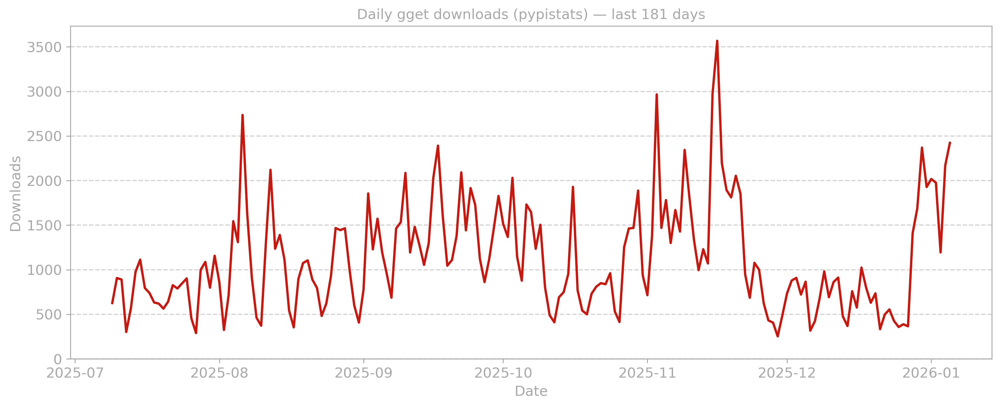

# Daily gget downloads (pypistats)

This repo uses GitHub Actions to generate a PNG plot of **daily** PyPI downloads for **gget**
over the **last 365 days**, using the [pypistats.org](https://pypistats.org) API.

## Output
- `plots/downloads_gget.png`

Automatically runs daily via GitHub Actions.
