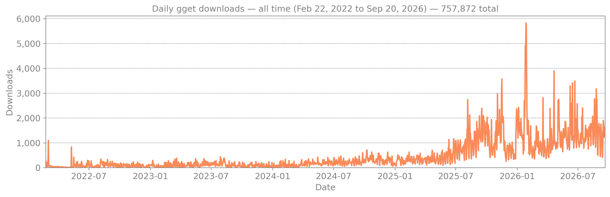
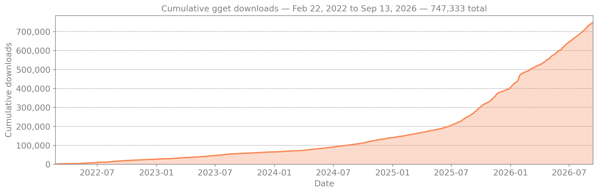
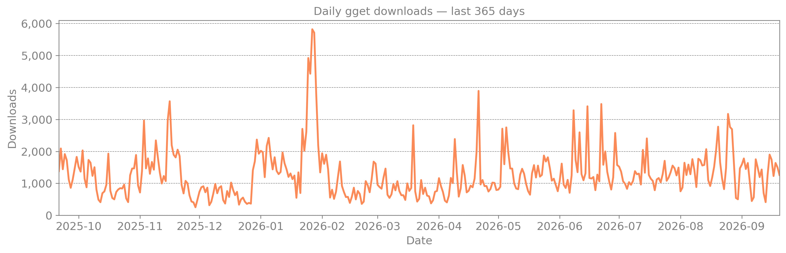
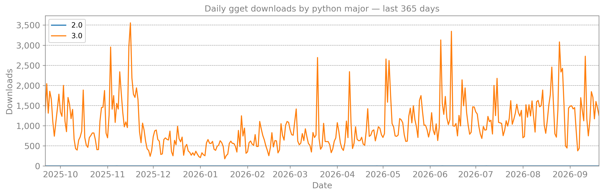
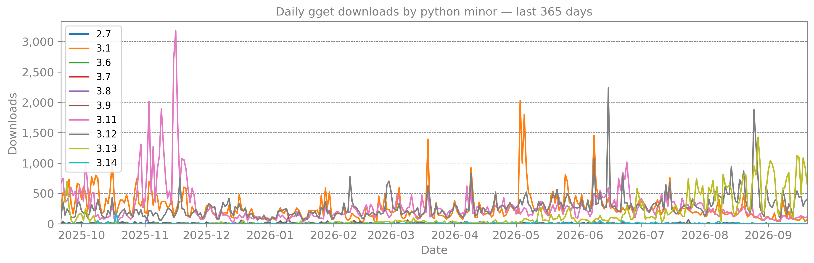
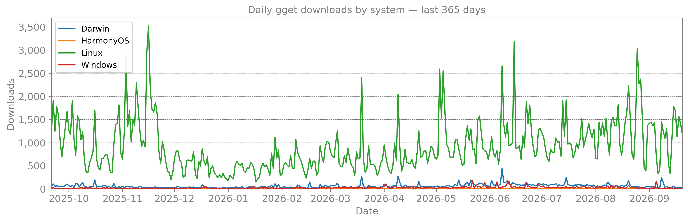
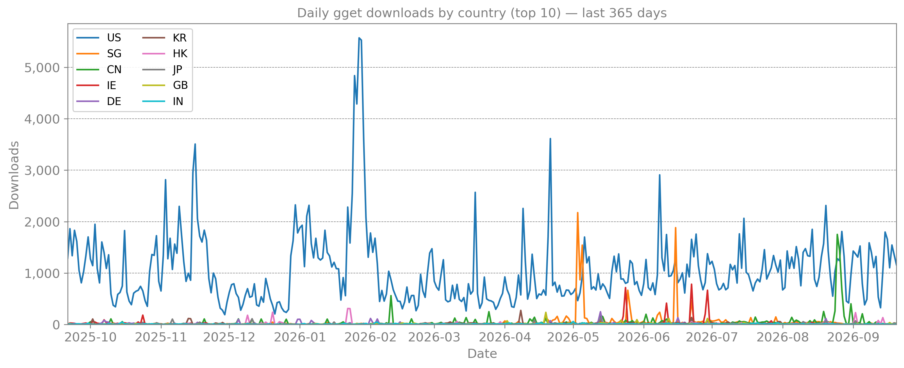
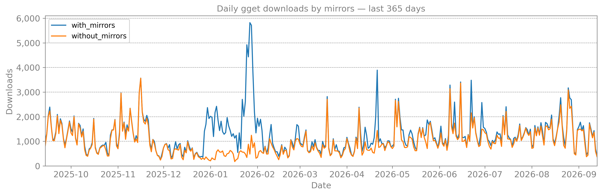

# gget downloads tracking

This repository tracks **PyPI download counts for [gget](https://pachterlab.github.io/gget/)** using Google BigQuery.

A GitHub Actions workflow runs weekly to:
1. Query the [BigQuery public PyPI dataset](https://console.cloud.google.com/bigquery?p=bigquery-public-data&d=pypi&t=file_downloads) for download statistics
2. Persist the data locally in CSV files (building a complete historical record)
3. Generate plots showing downloads by various breakdowns

Historical data is available from February 22, 2022 (gget's first release).

## All-time downloads



## Cumulative all-time downloads



## Last 365 days



### Downloads by Python major version


### Downloads by Python minor version


### Downloads by operating system


### Downloads by country (top 10)


### Downloads with/without mirrors


## Configuration

Edit `config.yaml` to customize:

```yaml
# Number of days to show in plots (default: 365)
plot_days: 365

# Breakdown types to track
breakdowns:
  - daily
  - python_major
  - python_minor
  - system
  - country
  - mirrors
```

## Output files

**Plots:**
- `plots/downloads_gget_alltime.png` - All-time daily downloads
- `plots/downloads_gget_cumulative.png` - Cumulative all-time downloads
- `plots/downloads_gget_daily.png` - Daily downloads (last N days)
- `plots/downloads_gget_python_major.png` - By Python major version
- `plots/downloads_gget_python_minor.png` - By Python minor version
- `plots/downloads_gget_system.png` - By operating system
- `plots/downloads_gget_country.png` - By country (top 10)
- `plots/downloads_gget_mirrors.png` - With/without mirrors

**Data:**
- `data/bigquery_gget_*.csv` - Raw download data from BigQuery

## Repository structure

```text
.
├── .github/
│   └── workflows/
│       └── downloads-plot.yml
├── scripts/
│   ├── fetch_bigquery_stats.py
│   └── generate_plots.py
├── plots/
├── data/
├── config.yaml
├── requirements.txt
└── README.md
```

## Local usage

```bash
# Install dependencies
pip install -r requirements.txt

# Authenticate to Google Cloud
gcloud auth application-default login

# Fetch latest data (last 10 days)
python scripts/fetch_bigquery_stats.py --days 10

# Or fetch all historical data
python scripts/fetch_bigquery_stats.py --initial

# Generate plots
python scripts/generate_plots.py

# Override plot days via CLI
python scripts/generate_plots.py --plot-days 180
```
